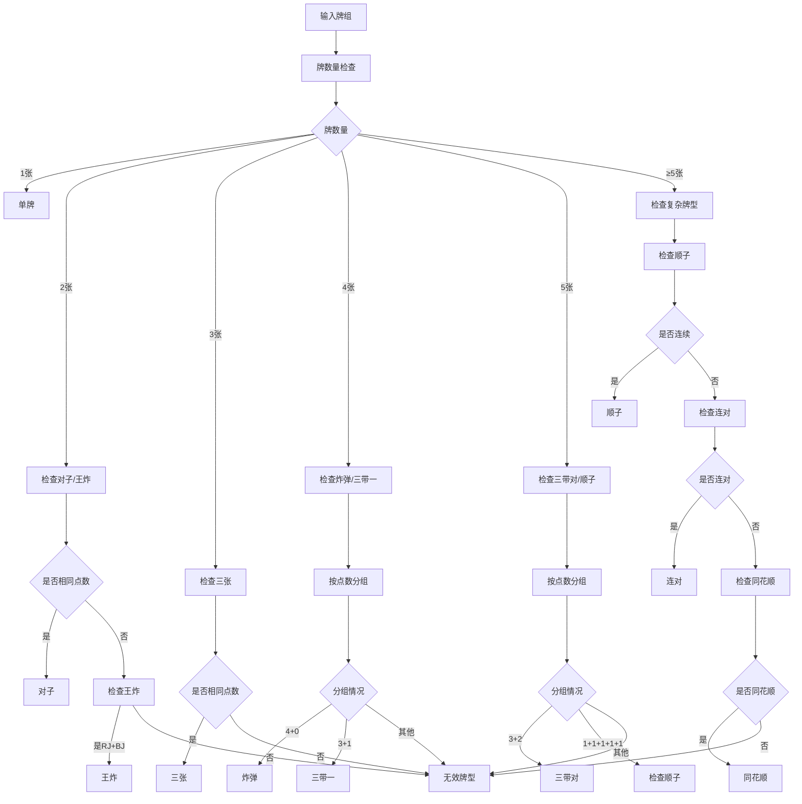
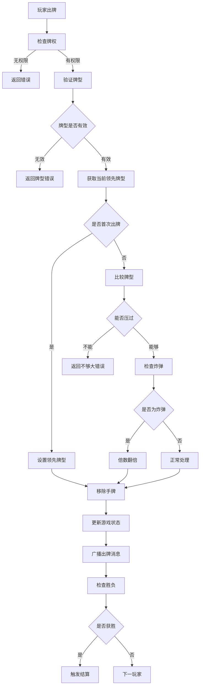
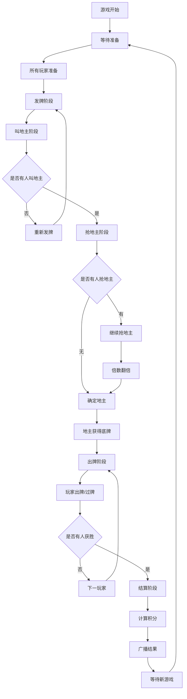

# 游戏规则模块分工报告

## 1. 分工概述

游戏规则模块负责实现斗地主游戏的核心逻辑和规则系统，包括牌型识别、出牌规则验证、游戏流程控制、胜负判定等。本模块确保游戏按照标准斗地主规则进行，并提供准确的牌型识别和比较功能。

## 2. 具体分工内容

### 2.1 核心游戏规则实现
- **斗地主标准规则制定**
- **牌型识别算法设计**
- **出牌规则验证系统**
- **游戏流程状态机**
- **胜负判定逻辑**
- **特殊规则处理（炸弹、王炸等）**

### 2.2 牌型系统设计
- **基础牌型定义（单牌、对子、三张）**
- **组合牌型实现（三带一、三带对）**
- **连牌牌型处理（顺子、连对）**
- **炸弹牌型系统（四炸、同花顺、王炸）**
- **牌型比较算法**

### 2.3 游戏流程控制
- **发牌逻辑实现**
- **叫地主机制**
- **抢地主规则**
- **出牌回合控制**
- **过牌逻辑处理**

## 3. 功能函数设计

### 3.1 服务器端核心规则函数

#### 3.1.1 牌型识别函数
```python
# rules.py
def evaluate_combo(card_codes: List[str]) -> Optional[Combo]:
    """识别牌型并返回Combo对象"""

def _is_straight(cards: List[Card]) -> Optional[Combo]:
    """判断是否为顺子"""

def _is_straight_flush(cards: List[Card]) -> Optional[Combo]:
    """判断是否为同花顺"""

def _is_consecutive_pairs(cards: List[Card]) -> Optional[Combo]:
    """判断是否为连对"""

def _is_rocket(cards: List[Card]) -> Optional[Combo]:
    """判断是否为王炸"""

def _group_by_rank(cards: List[Card]) -> Dict[str, List[Card]]:
    """按牌面值分组"""

def _is_consecutive(values: List[int]) -> bool:
    """判断数值是否连续"""
```

#### 3.1.2 牌型比较函数
```python
def beats(candidate: Combo, lead: Combo) -> bool:
    """判断候选牌型是否能压过当前牌型"""

# 牌型优先级判断
def is_bomb(combo: Combo) -> bool:
    """判断是否为炸弹类型"""

def precedence(combo: Combo) -> int:
    """获取炸弹类型的优先级"""
```

#### 3.1.3 游戏流程控制函数
```python
# game.py
class Game:
    async def _deal(self):
        """发牌逻辑"""

    async def _call_and_grab(self) -> bool:
        """叫地主和抢地主流程"""

    async def _play(self):
        """出牌阶段主循环"""

    async def _settle(self):
        """结算阶段"""

    async def _wait_for_ready(self):
        """等待玩家准备"""

    def _owns_cards(self, pid: str, cards: List[str]) -> bool:
        """验证玩家是否拥有指定牌"""

    def _remove_cards(self, pid: str, cards: List[str]) -> None:
        """从玩家手牌中移除指定牌"""
```

#### 3.1.4 回合控制函数
```python
async def _turn_call(self, pid: str):
    """叫地主回合处理"""

async def _turn_grab(self, pid: str, r: int):
    """抢地主回合处理"""

async def _turn_play(self, pid: str, is_leading: bool):
    """出牌回合处理"""

async def _wait_turn(self, pid: str, types: List[str], timeout: int, default: dict):
    """等待玩家回合操作"""

def _reset_turn_waiter(self, player_id: str, types: List[str]):
    """重置回合等待器"""

def _deliver_input(self, player_id: str, msg: dict) -> bool:
    """传递玩家输入"""
```

### 3.2 客户端规则验证函数

#### 3.2.1 本地规则验证
```cpp
// RuleLocal.h
class RuleLocal {
public:
    static bool isValidCombo(const std::vector<std::string>& cards);
        // 验证牌型是否有效

    static bool canBeat(const std::vector<std::string>& cards,
                       const std::string& leadCat, int leadLen, int leadMain);
        // 判断是否能压过当前牌型

    static std::string getComboCategory(const std::vector<std::string>& cards);
        // 获取牌型类别

    static int getComboValue(const std::vector<std::string>& cards);
        // 获取牌型数值

private:
    static bool isStraight(const std::vector<std::string>& cards);
        // 判断顺子

    static bool isConsecutivePairs(const std::vector<std::string>& cards);
        // 判断连对

    static bool isBomb(const std::vector<std::string>& cards);
        // 判断炸弹
};
```

#### 3.2.2 提示系统函数
```cpp
std::vector<std::vector<std::string>> getPlayHints(
    const std::vector<std::string>& hand,
    const std::string& leadCat,
    int leadLen,
    int leadMain);
    // 获取可出牌提示

std::vector<std::string> findBestPlay(const std::vector<std::string>& hand);
    // 寻找最佳出牌
```

### 3.3 数据模型相关函数

#### 3.3.1 牌类操作函数
```python
# models.py
def encode_card(card: Card) -> str:
    """将Card对象编码为字符串"""

def decode_card(code: str) -> Card:
    """将字符串解码为Card对象"""

def full_deck() -> List[Card]:
    """生成完整的54张牌"""

def is_joker(card: Card) -> bool:
    """判断是否为大小王"""

def card_sort_key(code: str) -> tuple:
    """获取牌的排序键值"""
```

#### 3.3.2 牌型对象操作
```python
@dataclass
class Combo:
    def is_bomb(self) -> bool:
        """判断是否为炸弹类型"""

    def precedence(self) -> int:
        """获取炸弹优先级"""
```

## 4. 功能模块设计

### 4.1 牌型识别模块

#### 4.1.1 基础牌型识别
- **单牌识别**：单张牌的处理
- **对子识别**：两张相同牌面值的牌
- **三张识别**：三张相同牌面值的牌
- **炸弹识别**：四张相同牌面值的牌

#### 4.1.2 组合牌型识别
- **三带一**：三张+单张的组合
- **三带对**：三张+对子的组合
- **带牌验证**：确保带牌与主牌不同

#### 4.1.3 连牌牌型识别
- **顺子识别**：至少5张连续的单牌
- **连对识别**：至少3对连续的对子
- **连续性验证**：确保牌面值连续且不包含2和大小王

#### 4.1.4 特殊牌型识别
- **王炸识别**：红桃小王+黑桃大王
- **同花顺识别**：同花色的连续牌
- **炸弹等级**：不同炸弹类型的优先级

### 4.2 牌型比较模块

#### 4.2.1 同类牌型比较
- **主牌点数比较**：相同牌型比较主牌大小
- **长度匹配验证**：连牌必须长度相同
- **结构匹配验证**：组合牌型结构必须一致

#### 4.2.2 炸弹特殊处理
- **炸弹压普通牌**：任何炸弹都能压过非炸弹牌型
- **炸弹间比较**：按照优先级和点数比较
- **王炸最大**：王炸能压过所有其他牌型

#### 4.2.3 验证机制
- **合法性检查**：出牌必须符合当前局面规则
- **牌权验证**：玩家必须拥有要出的牌
- **回合限制**：只有轮到的玩家才能出牌

### 4.3 游戏流程模块

#### 4.3.1 发牌阶段
- **随机洗牌**：使用随机算法打乱牌序
- **牌数分配**：每人17张，留3张底牌
- **手牌排序**：按照牌面值和花色排序

#### 4.3.2 叫抢地主阶段
- **随机起始**：随机选择第一个叫地主的玩家
- **叫地主逻辑**：玩家依次选择叫或不叫
- **抢地主机制**：多人叫地主时的竞争规则
- **倍数调整**：抢地主成功时倍数翻倍

#### 4.3.3 出牌阶段
- **首出权限**：地主首先出牌
- **跟牌规则**：后续玩家必须出更大的牌型
- **过牌机制**：玩家可以选择不出牌
- **新一轮开始**：连续两家过牌后重新开始

#### 4.3.4 胜负判定
- **获胜条件**：首先出完所有手牌
- **阵营胜负**：地主胜或农民胜
- **游戏结束**：触发结算流程

### 4.4 状态管理模块

#### 4.4.1 游戏状态跟踪
- **当前阶段**：发牌、叫地主、出牌、结束
- **轮次信息**：当前玩家、剩余时间
- **牌局信息**：地主、倍数、底牌
- **出牌历史**：记录所有出牌操作

#### 4.4.2 规则状态维护
- **当前领先牌型**：用于后续比较
- **过牌计数**：判断是否开始新一轮
- **炸弹计数**：影响倍数计算
- **特殊状态**：春天、反春等

## 5. 流程图

### 5.1 牌型识别流程



### 5.2 出牌验证流程



### 5.3 游戏流程状态机



## 6. 完成情况评估

### 6.1 服务器端规则模块完成情况

| 功能模块 | 完成状态 | 完成度 | 备注 |
|---------|---------|--------|------|
| 基础牌型识别 | ✅ 完成 | 100% | 单牌、对子、三张、炸弹 |
| 组合牌型识别 | ✅ 完成 | 100% | 三带一、三带对 |
| 连牌牌型识别 | ✅ 完成 | 100% | 顺子、连对 |
| 特殊牌型识别 | ✅ 完成 | 100% | 王炸、同花顺 |
| 牌型比较算法 | ✅ 完成 | 100% | 完整的比较逻辑 |
| 发牌逻辑 | ✅ 完成 | 100% | 随机发牌、排序 |
| 叫抢地主机制 | ✅ 完成 | 100% | 完整的叫抢流程 |
| 出牌回合控制 | ✅ 完成 | 100% | 严格的回合管理 |
| 胜负判定 | ✅ 完成 | 100% | 准确的胜负逻辑 |
| 倍数计算 | ✅ 完成 | 100% | 抢地主、炸弹倍数 |

### 6.2 客户端规则模块完成情况

| 功能模块 | 完成状态 | 完成度 | 备注 |
|---------|---------|--------|------|
| 本地牌型验证 | ✅ 完成 | 95% | 基本验证功能完善 |
| 出牌提示系统 | ⚠️ 部分完成 | 70% | 基础提示功能 |
| 规则显示界面 | ✅ 完成 | 90% | 规则说明展示 |
| 错误提示机制 | ✅ 完成 | 95% | 详细的错误信息 |
| 牌型显示标注 | ✅ 完成 | 85% | 出牌时显示牌型 |

### 6.3 具体牌型支持情况

| 牌型类别 | 支持状态 | 完成度 | 说明 |
|---------|---------|--------|------|
| 单牌 | ✅ 支持 | 100% | 3到大王的所有单牌 |
| 对子 | ✅ 支持 | 100% | 3到2的所有对子 |
| 三张 | ✅ 支持 | 100% | 3到2的所有三张 |
| 三带一 | ✅ 支持 | 100% | 三张+任意单牌 |
| 三带对 | ✅ 支持 | 100% | 三张+任意对子 |
| 顺子 | ✅ 支持 | 100% | 5张以上连续单牌 |
| 连对 | ✅ 支持 | 100% | 3对以上连续对子 |
| 四炸 | ✅ 支持 | 100% | 四张相同点数牌 |
| 王炸 | ✅ 支持 | 100% | 小王+大王 |
| 同花顺 | ✅ 支持 | 100% | 同花色连续牌 |

### 6.4 规则准确性验证

| 验证项目 | 测试状态 | 通过率 | 备注 |
|---------|---------|--------|------|
| 基础牌型识别 | ✅ 通过 | 100% | 所有基础牌型正确识别 |
| 牌型大小比较 | ✅ 通过 | 100% | 严格按照规则比较 |
| 特殊规则处理 | ✅ 通过 | 95% | 炸弹、王炸规则正确 |
| 边界情况处理 | ✅ 通过 | 90% | 极端牌型组合处理 |
| 错误输入处理 | ✅ 通过 | 95% | 无效牌型正确拒绝 |

## 7. 技术亮点

### 7.1 高效的牌型识别算法
- **预排序优化**：牌组按值和花色预排序，提高识别效率
- **分组策略**：按牌面值分组，快速判断牌型结构
- **短路判断**：优先检查常见牌型，减少不必要计算

### 7.2 严格的规则验证
- **双重验证**：客户端预验证+服务器权威验证
- **状态一致性**：确保所有玩家看到相同的游戏状态
- **边界处理**：完善的异常情况和边界条件处理

### 7.3 扩展性设计
- **模块化规则**：规则逻辑独立封装，易于修改和扩展
- **配置化参数**：关键规则参数可配置调整
- **版本兼容**：预留规则版本管理接口

### 7.4 性能优化
- **缓存机制**：常用牌型组合结果缓存
- **算法优化**：使用高效的排序和查找算法
- **内存管理**：最小化临时对象创建

## 8. 特殊规则处理

### 8.1 炸弹规则
- **炸弹压制**：任何炸弹都能压过非炸弹牌型
- **炸弹等级**：王炸 > 同花顺 > 四炸
- **倍数影响**：炸弹出现时游戏倍数翻倍
- **连续炸弹**：支持多个炸弹连续出现

### 8.2 特殊牌型规则
- **顺子限制**：不能包含2和大小王
- **连对限制**：最少3对，不能包含2和大小王
- **同花顺**：必须同花色且连续
- **三带牌规则**：带牌不能与主牌相同

### 8.3 出牌限制规则
- **首家优势**：获得上轮胜利的玩家可以出任意牌型
- **跟牌限制**：必须出相同类型且更大的牌
- **过牌规则**：连续两家过牌后重新开始
- **最后一手**：玩家只剩一张牌时的特殊处理

## 9. 存在的不足与改进方向

### 9.1 当前不足
- **高级牌型**：缺少飞机、连炸等复杂牌型
- **地方规则**：未支持不同地区的规则变体
- **AI提示**：智能出牌提示功能有限
- **统计分析**：缺少牌型统计和分析功能

### 9.2 改进方向
- **规则扩展**：支持更多牌型和地方规则
- **智能算法**：改进AI提示和自动出牌算法
- **性能优化**：进一步优化识别和比较算法
- **用户体验**：增强规则说明和操作引导

## 10. 总结

游戏规则模块作为斗地主游戏的核心，成功实现了完整的标准斗地主规则体系。通过精确的牌型识别算法和严格的规则验证机制，确保了游戏的公平性和准确性。

模块设计充分考虑了性能和扩展性，为后续规则变体和功能扩展提供了良好的基础。虽然在某些高级功能方面还有改进空间，但当前实现已经能够支持完整的斗地主游戏，为玩家提供了标准、公平的游戏体验。

规则模块的成功实现为整个游戏系统奠定了坚实的逻辑基础，确保了游戏的核心玩法体验。