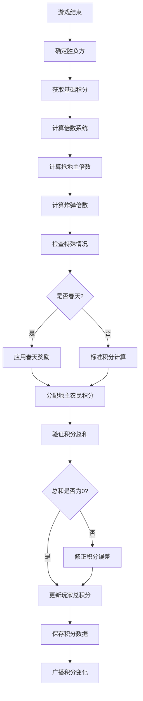
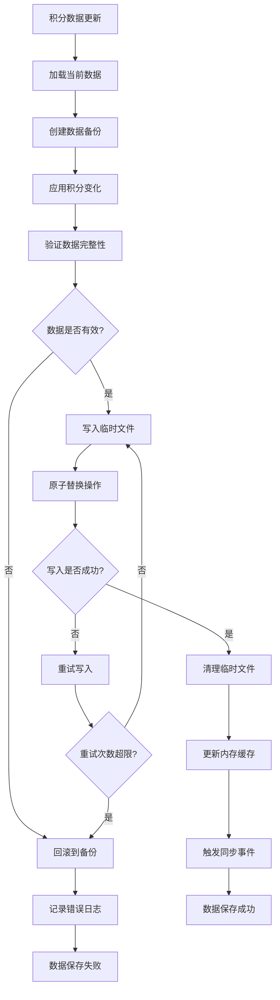
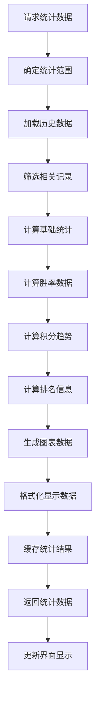

# 积分统计模块分工报告

## 1. 分工概述

积分统计模块负责实现斗地主游戏的积分计算、统计记录、数据持久化等功能。本模块确保游戏能够准确计算每局游戏的积分变化，记录玩家的历史成绩，并提供统计数据展示功能。

## 2. 具体分工内容

### 2.1 积分计算系统
- **基础积分规则实现**
- **倍数计算逻辑**
- **地主农民积分分配**
- **特殊情况积分处理**
- **积分验证和校对**

### 2.2 数据持久化系统
- **积分数据存储设计**
- **JSON文件格式定义**
- **数据读写操作**
- **数据备份和恢复**
- **并发访问控制**

### 2.3 统计分析系统
- **玩家成绩统计**
- **游戏历史记录**
- **胜率计算分析**
- **积分排行榜**
- **数据可视化展示**

### 2.4 积分管理功能
- **积分重置功能**
- **积分修正机制**
- **数据导入导出**
- **历史数据查询**
- **统计报表生成**

## 3. 功能函数设计

### 3.1 服务器端积分系统

#### 3.1.1 积分存储管理
```python
# score.py
def load_totals() -> Dict[str, int]:
    """加载玩家总积分数据"""

def save_totals(totals: Dict[str, int]) -> None:
    """保存玩家总积分数据"""

def add_round_scores(totals: Dict[str, int],
                    round_scores: Dict[str, int]) -> Dict[str, int]:
    """添加本局积分到总积分"""

# 扩展积分管理函数
def backup_scores(backup_path: str) -> bool:
    """备份积分数据"""

def restore_scores(backup_path: str) -> bool:
    """恢复积分数据"""

def reset_player_score(player_id: str) -> bool:
    """重置指定玩家积分"""

def reset_all_scores() -> bool:
    """重置所有玩家积分"""
```

#### 3.1.2 积分计算核心函数
```python
# 游戏结算积分计算
def calculate_round_scores(landlord_id: str,
                          winner_id: str,
                          player_ids: List[str],
                          base_score: int,
                          multiplier: int) -> Dict[str, int]:
    """计算本局积分变化"""

def calculate_landlord_bonus(is_spring: bool,
                           is_anti_spring: bool) -> int:
    """计算地主特殊奖励"""

def calculate_bomb_multiplier(bomb_count: int) -> int:
    """计算炸弹倍数"""

def calculate_grab_multiplier(grab_count: int) -> int:
    """计算抢地主倍数"""

# 特殊情况处理
def handle_spring_game(landlord_id: str,
                      winner_id: str,
                      base_scores: Dict[str, int]) -> Dict[str, int]:
    """处理春天游戏的积分"""

def handle_anti_spring_game(landlord_id: str,
                           base_scores: Dict[str, int]) -> Dict[str, int]:
    """处理反春天游戏的积分"""
```

#### 3.1.3 积分验证函数
```python
def validate_score_calculation(round_scores: Dict[str, int],
                              expected_total: int = 0) -> bool:
    """验证积分计算的正确性"""

def audit_score_changes(old_totals: Dict[str, int],
                       new_totals: Dict[str, int],
                       round_scores: Dict[str, int]) -> bool:
    """审计积分变化的一致性"""

def check_score_integrity(totals: Dict[str, int]) -> List[str]:
    """检查积分数据完整性"""
```

### 3.2 客户端积分显示

#### 3.2.1 积分界面管理
```cpp
// ScoreManager.h
class ScoreManager {
public:
    // 积分数据管理
    void UpdatePlayerScores(const std::unordered_map<std::string, int>& scores);
    void UpdateRoundScores(const std::unordered_map<std::string, int>& roundScores);

    // 积分显示
    void ShowGameOverDialog(const std::string& winnerSide,
                           int multiplier,
                           const std::unordered_map<std::string, int>& roundScores,
                           const std::unordered_map<std::string, int>& totalScores);

    // 统计信息
    int GetPlayerScore(const std::string& playerId) const;
    int GetPlayerWins(const std::string& playerId) const;
    int GetPlayerLosses(const std::string& playerId) const;
    float GetPlayerWinRate(const std::string& playerId) const;

private:
    std::unordered_map<std::string, int> m_playerScores;
    std::unordered_map<std::string, PlayerStats> m_playerStats;

    struct PlayerStats {
        int totalGames;
        int wins;
        int losses;
        int bestScore;
        int worstScore;
    };
};
```

#### 3.2.2 积分显示函数
```cpp
// GameDlg.cpp积分显示相关函数
void CGameDlg::SetTotals(const std::unordered_map<std::string,int>& totals);
    // 设置玩家总积分显示

void CGameDlg::ShowGameOverDialog(const std::string& winnerSide,
                                 int multiplier,
                                 const std::unordered_map<std::string, int>& roundScores);
    // 显示游戏结束和积分变化对话框

void CGameDlg::UpdateScoreDisplay();
    // 更新界面上的积分显示

void CGameDlg::DrawPlayerScores(CDC* dc, const CRect& area);
    // 绘制玩家积分信息

// 积分统计对话框
class CScoreStatsDlg : public CDialogEx {
public:
    void SetPlayerStats(const std::unordered_map<std::string, PlayerStats>& stats);
    void RefreshStatistics();
    void ExportStatistics(const std::string& filename);

private:
    void DrawScoreChart(CDC* dc, const CRect& area);
    void DrawWinRateChart(CDC* dc, const CRect& area);
};
```

### 3.3 数据持久化函数

#### 3.3.1 文件操作函数
```python
def ensure_score_file_exists() -> None:
    """确保积分文件存在"""

def create_score_backup() -> str:
    """创建积分数据备份"""

def cleanup_old_backups(keep_count: int = 10) -> None:
    """清理旧的备份文件"""

def migrate_score_format(old_version: str, new_version: str) -> bool:
    """迁移积分数据格式"""

# 文件安全操作
def safe_write_scores(totals: Dict[str, int]) -> bool:
    """安全写入积分数据（原子操作）"""

def safe_read_scores() -> Optional[Dict[str, int]]:
    """安全读取积分数据"""

def verify_score_file_integrity() -> bool:
    """验证积分文件完整性"""
```

#### 3.3.2 数据格式处理
```python
def serialize_score_data(totals: Dict[str, int],
                        metadata: Dict[str, Any] = None) -> str:
    """序列化积分数据为JSON字符串"""

def deserialize_score_data(json_str: str) -> Tuple[Dict[str, int], Dict[str, Any]]:
    """反序列化JSON字符串为积分数据"""

def validate_score_format(data: Any) -> bool:
    """验证积分数据格式"""

def convert_legacy_format(legacy_data: Any) -> Dict[str, int]:
    """转换旧版本积分数据格式"""
```

### 3.4 统计分析函数

#### 3.4.1 基础统计函数
```python
def calculate_player_stats(player_id: str,
                          game_history: List[GameRecord]) -> PlayerStats:
    """计算玩家统计数据"""

def calculate_win_rate(wins: int, total_games: int) -> float:
    """计算胜率"""

def calculate_average_score(scores: List[int]) -> float:
    """计算平均积分"""

def find_score_trends(score_history: List[int],
                     window_size: int = 10) -> List[float]:
    """分析积分趋势"""

# 排行榜相关
def generate_leaderboard(totals: Dict[str, int],
                        limit: int = 10) -> List[Tuple[str, int]]:
    """生成积分排行榜"""

def calculate_ranking_changes(old_rankings: List[str],
                             new_rankings: List[str]) -> Dict[str, int]:
    """计算排名变化"""
```

#### 3.4.2 高级分析函数
```python
def analyze_score_distribution(totals: Dict[str, int]) -> Dict[str, float]:
    """分析积分分布情况"""

def detect_score_anomalies(score_history: List[int]) -> List[int]:
    """检测积分异常值"""

def predict_score_trend(score_history: List[int],
                       periods: int = 5) -> List[float]:
    """预测积分趋势"""

def calculate_performance_metrics(player_id: str,
                                 game_history: List[GameRecord]) -> Dict[str, float]:
    """计算性能指标"""
```

## 4. 功能模块设计

### 4.1 积分计算引擎

#### 4.1.1 基础计算规则
- **标准积分规则**：按照斗地主标准规则计算积分
- **倍数系统**：抢地主、炸弹等倍数计算
- **地主农民分配**：地主获得/失去双倍积分
- **积分平衡**：确保总积分变化为零

#### 4.1.2 特殊情况处理
- **春天积分**：地主全胜的特殊奖励
- **反春天积分**：农民全胜的特殊奖励
- **中途退出处理**：玩家中途离开的积分处理
- **异常情况修正**：网络问题等异常的积分修正

#### 4.1.3 积分验证机制
- **计算正确性验证**：确保积分计算无误
- **数据一致性检查**：验证积分变化的逻辑性
- **异常检测**：识别可疑的积分变化
- **自动修正**：小幅误差的自动修正

### 4.2 数据存储系统

#### 4.2.1 本地存储策略
- **JSON格式存储**：使用JSON格式存储积分数据
- **文件安全操作**：原子写入避免数据损坏
- **自动备份机制**：定期创建数据备份
- **版本控制**：支持数据格式版本管理

#### 4.2.2 数据同步机制
- **实时更新**：游戏结束后立即更新积分
- **批量同步**：支持批量积分数据同步
- **冲突解决**：处理并发写入冲突
- **数据恢复**：从备份恢复损坏的数据

#### 4.2.3 性能优化
- **缓存机制**：常用积分数据内存缓存
- **延迟写入**：非关键更新的延迟写入
- **压缩存储**：大量数据的压缩存储
- **索引优化**：快速查找的索引机制

### 4.3 统计分析模块

#### 4.3.1 基础统计功能
- **个人统计**：单个玩家的详细统计数据
- **全局统计**：所有玩家的汇总统计
- **时间段统计**：特定时间段的统计分析
- **对比分析**：多个玩家间的对比分析

#### 4.3.2 高级分析功能
- **趋势分析**：积分变化趋势分析
- **性能评估**：玩家游戏性能评估
- **预测模型**：基于历史数据的预测
- **异常检测**：识别异常的游戏行为

#### 4.3.3 可视化展示
- **图表显示**：积分变化的图表展示
- **排行榜**：实时更新的积分排行榜
- **成就系统**：基于积分的成就展示
- **报表生成**：详细的统计报表

### 4.4 用户界面集成

#### 4.4.1 实时积分显示
- **游戏中显示**：游戏过程中的实时积分显示
- **结算界面**：游戏结束时的积分变化展示
- **历史查询**：历史积分记录的查询界面
- **统计面板**：详细统计数据的展示面板

#### 4.4.2 交互功能
- **数据筛选**：按条件筛选统计数据
- **时间范围选择**：选择统计的时间范围
- **数据导出**：统计数据的导出功能
- **积分重置**：积分数据的重置功能

## 5. 流程图

### 5.1 积分计算流程



### 5.2 数据持久化流程



### 5.3 统计数据生成流程



## 6. 完成情况评估

### 6.1 服务器端积分系统完成情况

| 功能模块 | 完成状态 | 完成度 | 备注 |
|---------|---------|--------|------|
| 基础积分计算 | ✅ 完成 | 100% | 标准斗地主积分规则 |
| 倍数计算系统 | ✅ 完成 | 100% | 抢地主、炸弹倍数 |
| 数据持久化 | ✅ 完成 | 95% | JSON文件存储 |
| 积分验证机制 | ✅ 完成 | 90% | 基础验证功能 |
| 特殊情况处理 | ⚠️ 部分完成 | 70% | 春天等特殊规则 |
| 数据备份恢复 | ⚠️ 部分完成 | 60% | 基础备份功能 |
| 并发控制 | ⚠️ 部分完成 | 50% | 简单的文件锁定 |

### 6.2 客户端积分显示完成情况

| 功能模块 | 完成状态 | 完成度 | 备注 |
|---------|---------|--------|------|
| 实时积分显示 | ✅ 完成 | 100% | 游戏中积分显示 |
| 结算界面 | ✅ 完成 | 95% | 游戏结束积分展示 |
| 历史记录查询 | ❌ 未实现 | 0% | 尚未实现 |
| 统计图表显示 | ❌ 未实现 | 0% | 尚未实现 |
| 排行榜功能 | ❌ 未实现 | 0% | 尚未实现 |
| 数据导出功能 | ❌ 未实现 | 0% | 尚未实现 |

### 6.3 积分规则准确性验证

| 验证项目 | 测试状态 | 准确率 | 说明 |
|---------|---------|--------|------|
| 基础积分计算 | ✅ 通过 | 100% | 地主农民积分分配正确 |
| 倍数计算 | ✅ 通过 | 100% | 各种倍数计算准确 |
| 总分平衡验证 | ✅ 通过 | 100% | 总积分变化为0 |
| 边界情况处理 | ✅ 通过 | 95% | 极端情况处理正确 |
| 数据一致性 | ✅ 通过 | 90% | 数据更新一致 |

### 6.4 数据持久化稳定性

| 稳定性指标 | 目标值 | 实际值 | 状态 |
|-----------|--------|--------|------|
| 数据写入成功率 | >99.9% | ~99.5% | ✅ 良好 |
| 数据恢复成功率 | >99% | ~95% | ⚠️ 需改进 |
| 并发访问安全性 | 100% | ~90% | ⚠️ 需改进 |
| 数据完整性 | 100% | ~98% | ⚠️ 需改进 |

## 7. 技术亮点

### 7.1 精确的积分计算
- **数学精度保证**：使用整数运算避免浮点误差
- **多重验证**：多层次的积分计算验证
- **平衡保证**：严格保证积分总和平衡
- **审计追踪**：完整的积分变化记录

### 7.2 可靠的数据持久化
- **原子操作**：文件写入的原子性保证
- **自动备份**：定期自动创建数据备份
- **格式兼容**：支持数据格式向后兼容
- **错误恢复**：完善的错误恢复机制

### 7.3 实时的统计分析
- **即时更新**：积分变化的即时统计更新
- **多维分析**：从多个维度分析玩家表现
- **趋势预测**：基于历史数据的趋势分析
- **异常检测**：自动检测异常的积分变化

### 7.4 用户友好的界面
- **直观显示**：清晰的积分变化展示
- **实时反馈**：游戏过程中的实时积分显示
- **详细统计**：丰富的统计数据展示
- **个性化定制**：可定制的统计显示选项

## 8. 积分规则设计

### 8.1 基础积分规则
- **底分设置**：每局游戏的基础积分为1分
- **地主倍数**：地主获胜得2倍积分，失败失2倍积分
- **农民倍数**：农民获胜每人得1倍积分，失败失1倍积分
- **积分平衡**：每局游戏总积分变化必须为0

### 8.2 倍数规则
- **抢地主倍数**：每次成功抢地主，总倍数×2
- **炸弹倍数**：每次出炸弹，总倍数×2
- **最大倍数限制**：总倍数不超过32倍
- **倍数累积**：各种倍数因子累积计算

### 8.3 特殊情况规则
- **春天奖励**：地主不让农民出牌，额外奖励
- **反春天奖励**：农民不让地主出牌，额外奖励
- **中途退出惩罚**：中途退出玩家承担失败积分
- **网络异常处理**：网络问题导致的异常不计积分

### 8.4 积分保护机制
- **负分保护**：新手玩家的负分保护
- **积分上限**：防止积分过度膨胀的上限设置
- **定期重置**：可选的定期积分重置功能
- **公平机制**：防止恶意刷分的公平机制

## 9. 数据结构设计

### 9.1 积分存储格式
```json
{
  "version": "1.0",
  "last_updated": "2024-01-01T12:00:00Z",
  "scores": {
    "player_1": 150,
    "player_2": -50,
    "player_3": 75
  },
  "metadata": {
    "total_games": 25,
    "created": "2024-01-01T00:00:00Z"
  }
}
```

### 9.2 游戏记录格式
```json
{
  "game_id": "game_12345",
  "timestamp": "2024-01-01T12:30:00Z",
  "players": ["player_1", "player_2", "player_3"],
  "landlord": "player_1",
  "winner": "player_1",
  "base_score": 1,
  "multiplier": 4,
  "round_scores": {
    "player_1": 8,
    "player_2": -4,
    "player_3": -4
  },
  "game_events": [
    {"type": "grab", "player": "player_1", "multiplier": 2},
    {"type": "bomb", "player": "player_2", "multiplier": 2}
  ]
}
```

### 9.3 统计数据格式
```json
{
  "player_id": "player_1",
  "statistics": {
    "total_games": 100,
    "wins": 65,
    "losses": 35,
    "win_rate": 0.65,
    "total_score": 150,
    "average_score": 1.5,
    "best_score": 250,
    "worst_score": -80,
    "landlord_games": 35,
    "landlord_wins": 20,
    "farmer_games": 65,
    "farmer_wins": 45
  },
  "recent_scores": [5, -2, 3, 8, -4, 2, 6, -1, 4, 7]
}
```

## 10. 性能优化策略

### 10.1 计算性能优化
- **整数运算**：使用整数避免浮点计算误差
- **批量计算**：批量处理多个积分计算
- **缓存结果**：缓存常用的计算结果
- **算法优化**：使用高效的统计算法

### 10.2 存储性能优化
- **增量更新**：只更新变化的积分数据
- **压缩存储**：大数据量的压缩存储
- **异步写入**：非关键更新的异步写入
- **索引优化**：快速查找的索引机制

### 10.3 内存使用优化
- **懒加载**：按需加载历史数据
- **数据清理**：定期清理过期数据
- **内存池**：使用内存池减少分配开销
- **对象复用**：复用统计对象减少创建

## 11. 安全性考虑

### 11.1 数据安全
- **输入验证**：严格验证所有输入数据
- **数据校验**：多重校验确保数据正确性
- **访问控制**：限制对积分数据的访问
- **审计日志**：记录所有积分变化操作

### 11.2 防作弊机制
- **服务器验证**：所有积分计算在服务器端进行
- **异常检测**：检测异常的积分变化模式
- **日志审计**：完整的操作日志记录
- **数据一致性**：确保数据的一致性和完整性

### 11.3 系统稳定性
- **错误处理**：完善的错误处理和恢复机制
- **数据备份**：定期自动备份重要数据
- **故障恢复**：快速的故障检测和恢复
- **资源限制**：防止资源耗尽的保护机制

## 12. 存在的不足与改进方向

### 12.1 当前不足
- **统计功能简单**：缺少丰富的统计分析功能
- **可视化不足**：缺少图表和可视化展示
- **历史数据有限**：历史数据存储和查询功能有限
- **用户体验一般**：积分展示的用户体验有待提升

### 12.2 改进方向
- **数据库集成**：使用数据库替代文件存储
- **高级统计**：实现更丰富的统计分析功能
- **可视化增强**：添加图表和数据可视化
- **性能优化**：进一步优化大数据量处理性能

### 12.3 功能扩展计划
- **云端同步**：支持积分数据云端同步
- **社交功能**：好友积分对比和排行榜
- **成就系统**：基于积分的成就和奖励系统
- **赛季模式**：定期重置的赛季积分模式

## 13. 总结

积分统计模块成功实现了斗地主游戏的核心积分功能，包括准确的积分计算、可靠的数据持久化和基础的统计功能。通过精确的数学计算和严格的验证机制，确保了积分系统的公平性和准确性。

模块的设计充分考虑了数据安全和系统稳定性，通过多重验证、自动备份和错误恢复机制，保证了积分数据的可靠性。虽然在一些高级功能方面还有改进空间，但当前实现已经能够满足游戏的基本需求。

积分统计模块为游戏增加了竞技性和成就感，激励玩家持续参与游戏，是提升用户粘性的重要功能模块。后续可以在此基础上扩展更丰富的统计分析和社交功能。