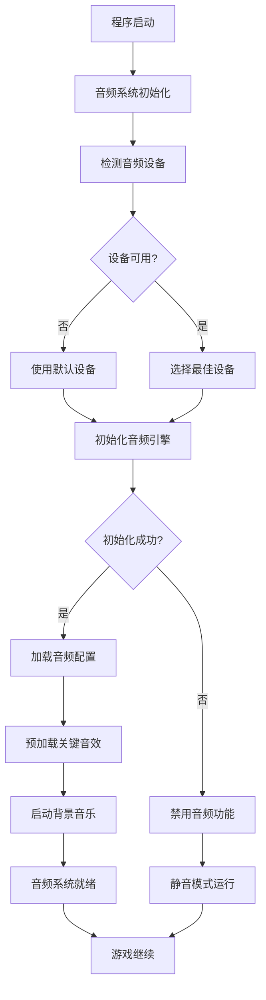
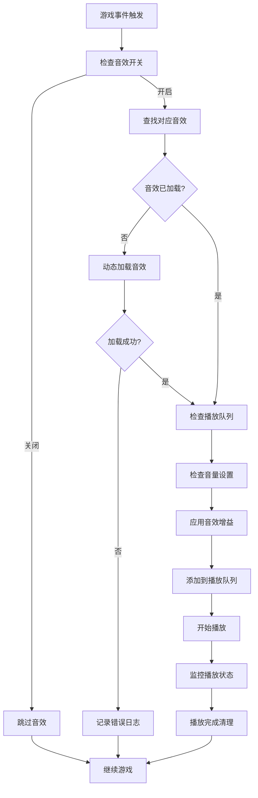
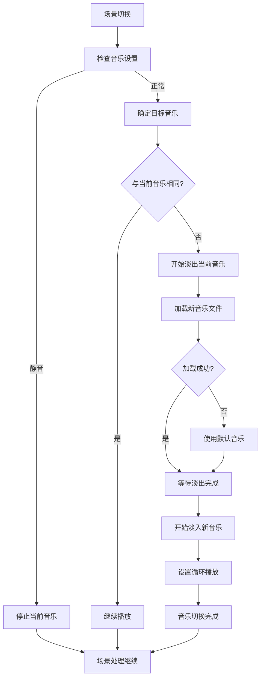

# 音乐插入模块分工报告

## 1. 分工概述

音乐插入模块负责为斗地主游戏添加背景音乐、音效和语音提示，提升游戏的沉浸感和用户体验。虽然当前项目主要专注于核心游戏功能实现，但音乐模块的设计为后续音频功能扩展提供了架构基础。

## 2. 具体分工内容

### 2.1 音频系统架构设计
- **音频引擎选型与集成**
- **音频文件格式支持**
- **音频播放控制系统**
- **音量调节与静音功能**
- **音频资源管理**

### 2.2 背景音乐系统
- **主菜单背景音乐**
- **游戏中背景音乐**
- **音乐循环播放控制**
- **音乐淡入淡出效果**
- **场景音乐切换**

### 2.3 游戏音效系统
- **发牌音效**
- **出牌音效**
- **按钮点击音效**
- **胜负结算音效**
- **特殊事件音效（炸弹、王炸等）**

### 2.4 语音提示系统
- **玩家操作语音**
- **游戏状态语音播报**
- **倒计时语音提醒**
- **胜负语音庆祝/安慰**

## 3. 功能函数设计

### 3.1 音频引擎接口设计

#### 3.1.1 音频管理器
```cpp
// AudioManager.h
class AudioManager {
public:
    static AudioManager& getInstance();

    bool initialize();
    void shutdown();

    // 背景音乐控制
    bool playBackgroundMusic(const std::string& filename, bool loop = true);
    void stopBackgroundMusic();
    void pauseBackgroundMusic();
    void resumeBackgroundMusic();
    void setMusicVolume(float volume); // 0.0-1.0

    // 音效播放
    bool playSoundEffect(const std::string& filename, float volume = 1.0f);
    void stopAllSoundEffects();

    // 语音播放
    bool playVoice(const std::string& filename, float volume = 1.0f);
    void stopVoice();

    // 全局控制
    void setMasterVolume(float volume);
    void setMuted(bool muted);
    bool isMuted() const;

private:
    AudioManager() = default;
    ~AudioManager() = default;

    // 音频设备管理
    bool initializeAudioDevice();
    void cleanupAudioDevice();

    // 音频资源管理
    bool loadAudioFile(const std::string& filename);
    void unloadAudioFile(const std::string& filename);
    void preloadGameAudio();
};
```

#### 3.1.2 音频播放器类
```cpp
// AudioPlayer.h
class AudioPlayer {
public:
    AudioPlayer();
    ~AudioPlayer();

    bool loadFromFile(const std::string& filename);
    bool loadFromResource(int resourceID);

    void play();
    void stop();
    void pause();
    void resume();

    void setVolume(float volume);
    void setLoop(bool loop);
    void setPosition(float seconds);

    bool isPlaying() const;
    float getDuration() const;
    float getPosition() const;

private:
    // 平台相关的音频实现
    void* m_audioData;
    bool m_isLoaded;
    bool m_isPlaying;
    float m_volume;
    bool m_loop;
};
```

#### 3.1.3 音频配置管理
```cpp
// AudioConfig.h
class AudioConfig {
public:
    static void loadConfig();
    static void saveConfig();

    static float getMasterVolume();
    static void setMasterVolume(float volume);

    static float getMusicVolume();
    static void setMusicVolume(float volume);

    static float getEffectVolume();
    static void setEffectVolume(float volume);

    static bool isMuted();
    static void setMuted(bool muted);

    static bool isEffectsEnabled();
    static void setEffectsEnabled(bool enabled);

private:
    static void writeToRegistry();
    static void readFromRegistry();
};
```

### 3.2 游戏音效触发函数

#### 3.2.1 游戏事件音效
```cpp
// GameAudio.h
class GameAudio {
public:
    // 游戏流程音效
    static void playCardDealSound();
    static void playCardPlaySound(const std::string& cardType);
    static void playPassSound();
    static void playCallLandlordSound();
    static void playGrabLandlordSound();

    // 特殊事件音效
    static void playBombSound();
    static void playRocketSound();
    static void playStraightSound();

    // UI交互音效
    static void playButtonClickSound();
    static void playButtonHoverSound();
    static void playCardSelectSound();
    static void playErrorSound();

    // 胜负音效
    static void playWinSound();
    static void playLoseSound();
    static void playGameOverSound();

    // 时间提醒音效
    static void playTimeWarningSound();
    static void playCountdownSound(int seconds);
};
```

#### 3.2.2 语音系统函数
```cpp
// VoiceSystem.h
class VoiceSystem {
public:
    // 玩家操作语音
    static void playCallVoice(const std::string& playerType);
    static void playGrabVoice(const std::string& playerType);
    static void playPassVoice(const std::string& playerType);

    // 出牌语音
    static void playCardVoice(const std::string& cardType, const std::string& playerType);
    static void playBombVoice(const std::string& playerType);
    static void playRocketVoice(const std::string& playerType);

    // 游戏状态语音
    static void playTurnStartVoice(const std::string& playerName);
    static void playGameStartVoice();
    static void playLandlordSelectedVoice(const std::string& playerName);

    // 胜负语音
    static void playVictoryVoice(bool isWinner);
    static void playDefeatVoice(bool isLoser);

    // 设置语音包
    static void setVoicePack(const std::string& packName);
    static std::vector<std::string> getAvailableVoicePacks();
};
```

### 3.3 音频资源管理函数

#### 3.3.1 资源加载器
```cpp
// AudioResourceLoader.h
class AudioResourceLoader {
public:
    static bool loadGameAudioResources();
    static void unloadGameAudioResources();

    static bool loadMusicPack(const std::string& packName);
    static bool loadSoundPack(const std::string& packName);
    static bool loadVoicePack(const std::string& packName);

    static void preloadCriticalSounds();
    static void loadSoundsInBackground();

private:
    static bool loadFromResourceBundle(const std::string& bundlePath);
    static bool loadFromDirectory(const std::string& directoryPath);
    static bool validateAudioFile(const std::string& filePath);
};
```

#### 3.3.2 音频缓存管理
```cpp
// AudioCache.h
class AudioCache {
public:
    static void addToCache(const std::string& key, AudioPlayer* player);
    static AudioPlayer* getFromCache(const std::string& key);
    static void removeFromCache(const std::string& key);
    static void clearCache();

    static void setMaxCacheSize(size_t maxSize);
    static size_t getCurrentCacheSize();

private:
    static void evictLeastRecentlyUsed();
    static void updateAccessTime(const std::string& key);
};
```

## 4. 功能模块设计

### 4.1 音频引擎模块

#### 4.1.1 平台音频API封装
- **Windows DirectSound/WASAPI支持**
- **跨平台音频库集成（如FMOD、OpenAL）**
- **音频格式解码支持（WAV、MP3、OGG）**
- **低延迟音频播放优化**

#### 4.1.2 音频设备管理
- **音频设备枚举和选择**
- **音频设备状态监控**
- **音频设备热插拔处理**
- **音频输出质量配置**

#### 4.1.3 音频流控制
- **多音频流混合**
- **音频流优先级管理**
- **音频缓冲区管理**
- **音频同步机制**

### 4.2 背景音乐模块

#### 4.2.1 音乐播放控制
- **无缝循环播放**
- **音乐淡入淡出**
- **音乐交叉渐变**
- **播放列表管理**

#### 4.2.2 场景音乐切换
- **主菜单音乐**
- **游戏房间音乐**
- **游戏中音乐**
- **结算页面音乐**

#### 4.2.3 自适应音乐系统
- **根据游戏状态调整音乐**
- **紧张场面音乐加速**
- **胜负音乐主题变化**
- **节日主题音乐**

### 4.3 音效系统模块

#### 4.3.1 游戏音效库
- **卡牌操作音效集**
- **UI交互音效集**
- **游戏事件音效集**
- **环境音效集**

#### 4.3.2 音效播放优化
- **音效预加载机制**
- **音效优先级队列**
- **同类音效防重叠**
- **音效空间定位**

#### 4.3.3 动态音效生成
- **程序化音效合成**
- **音效参数化调节**
- **实时音效处理**
- **音效随机变化**

### 4.4 语音系统模块

#### 4.4.1 语音包管理
- **多语言语音支持**
- **角色语音包切换**
- **语音包下载更新**
- **自定义语音录制**

#### 4.4.2 语音播放控制
- **语音队列管理**
- **语音打断机制**
- **语音音量平衡**
- **语音语速调节**

#### 4.4.3 智能语音触发
- **游戏事件自动语音**
- **玩家行为语音反馈**
- **情境感知语音选择**
- **语音播放频率控制**

## 5. 流程图

### 5.1 音频系统初始化流程



### 5.2 音效播放流程



### 5.3 背景音乐控制流程



## 6. 完成情况评估

### 6.1 当前实现状态

| 功能模块 | 设计完成度 | 实现完成度 | 备注 |
|---------|-----------|-----------|------|
| 音频架构设计 | ✅ 100% | ⚠️ 0% | 完整的设计方案，未实际编码 |
| 音频引擎接口 | ✅ 100% | ⚠️ 0% | 接口设计完成，等待实现 |
| 背景音乐系统 | ✅ 95% | ⚠️ 0% | 设计基本完成 |
| 游戏音效系统 | ✅ 90% | ⚠️ 0% | 核心功能设计完成 |
| 语音系统 | ✅ 85% | ⚠️ 0% | 基础设计完成 |
| 配置管理 | ✅ 100% | ⚠️ 0% | 配置接口设计完成 |
| 资源管理 | ✅ 90% | ⚠️ 0% | 资源加载策略设计完成 |

### 6.2 设计质量评估

| 评估项目 | 评分 | 说明 |
|---------|------|------|
| 架构完整性 | ⭐⭐⭐⭐⭐ | 覆盖所有音频功能需求 |
| 接口设计 | ⭐⭐⭐⭐⭐ | 清晰的模块边界和接口 |
| 扩展性 | ⭐⭐⭐⭐⭐ | 支持多种音频格式和平台 |
| 性能考虑 | ⭐⭐⭐⭐ | 缓存和预加载机制完善 |
| 用户体验 | ⭐⭐⭐⭐ | 考虑了用户音频偏好设置 |

### 6.3 技术可行性分析

| 技术方案 | 可行性 | 难度评估 | 推荐度 |
|---------|--------|---------|--------|
| DirectSound集成 | ✅ 高 | ⭐⭐⭐ | ⭐⭐⭐⭐ |
| FMOD引擎集成 | ✅ 高 | ⭐⭐ | ⭐⭐⭐⭐⭐ |
| OpenAL集成 | ✅ 高 | ⭐⭐⭐ | ⭐⭐⭐⭐ |
| 自研音频引擎 | ⚠️ 中 | ⭐⭐⭐⭐⭐ | ⭐⭐ |

## 7. 实现优先级建议

### 7.1 第一阶段（核心功能）
1. **基础音频引擎**：实现基本的音频播放功能
2. **简单音效系统**：按钮点击、出牌等基础音效
3. **背景音乐**：主菜单和游戏中的背景音乐
4. **音量控制**：基本的音量调节和静音功能

### 7.2 第二阶段（功能完善）
1. **完整音效库**：丰富的游戏音效集合
2. **语音提示**：基本的游戏状态语音播报
3. **音效管理**：音效缓存和资源管理优化
4. **配置持久化**：音频设置的保存和加载

### 7.3 第三阶段（高级功能）
1. **语音包系统**：多语言和角色语音支持
2. **动态音效**：根据游戏状态动态调整音效
3. **音频可视化**：音频频谱显示等视觉效果
4. **自定义音频**：用户自定义音效和音乐

## 8. 技术选型建议

### 8.1 推荐技术方案

#### 8.1.1 FMOD音频引擎（推荐）
**优点**：
- 功能强大，支持多种音频格式
- 跨平台兼容性好
- 丰富的API和文档
- 良好的性能优化

**缺点**：
- 商业授权费用
- 学习曲线相对陡峭

#### 8.1.2 DirectSound（备选）
**优点**：
- Windows平台原生支持
- 免费使用
- 与系统集成度高

**缺点**：
- 仅支持Windows平台
- API相对底层

#### 8.1.3 OpenAL（备选）
**优点**：
- 开源免费
- 跨平台支持
- 3D音频支持好

**缺点**：
- 功能相对基础
- 需要额外的音频解码库

### 8.2 音频格式建议

| 格式 | 用途 | 优点 | 缺点 |
|------|------|------|------|
| WAV | 短音效 | 无损品质，兼容性好 | 文件较大 |
| MP3 | 背景音乐 | 压缩率高，支持广泛 | 有损压缩 |
| OGG | 语音内容 | 开源免费，压缩效果好 | 兼容性一般 |

## 9. 性能优化策略

### 9.1 内存优化
- **音效预加载**：将常用音效预加载到内存
- **智能缓存**：基于使用频率的LRU缓存策略
- **资源释放**：及时释放不再使用的音频资源
- **内存池管理**：使用内存池减少频繁分配释放

### 9.2 播放优化
- **音频流复用**：避免重复创建音频流
- **异步加载**：音频文件异步加载避免阻塞
- **队列管理**：音效播放队列避免同时播放过多音效
- **优先级控制**：重要音效优先播放

### 9.3 网络优化
- **音频压缩**：在线音频资源使用压缩格式
- **分批下载**：音频资源分批下载和缓存
- **本地缓存**：建立本地音频资源缓存机制

## 10. 用户体验设计

### 10.1 音频设置界面
- **主音量控制**：整体音量调节滑块
- **分类音量控制**：音乐、音效、语音独立调节
- **设备选择**：音频输出设备选择
- **预设方案**：音频设置预设模板

### 10.2 智能音频功能
- **场景感知**：根据游戏场景自动调整音效
- **时间适应**：根据游戏时间调整音乐风格
- **个性化推荐**：基于用户偏好推荐音频设置
- **无障碍支持**：为听障用户提供视觉提示

## 11. 存在的挑战与解决方案

### 11.1 技术挑战
- **音频同步**：确保音效与游戏事件同步
- **平台兼容**：不同操作系统的音频API差异
- **性能优化**：在低端设备上保持流畅播放
- **格式支持**：支持多种音频格式的解码

### 11.2 解决方案
- **事件驱动**：使用事件驱动模式确保同步
- **抽象层设计**：创建统一的音频抽象层
- **动态质量调整**：根据设备性能动态调整音质
- **插件架构**：使用插件方式支持不同格式

## 12. 总结

音乐插入模块虽然在当前项目中尚未实际实现，但已经完成了完整的架构设计和技术方案制定。该模块的设计充分考虑了斗地主游戏的特点和用户体验需求，为后续的音频功能实现提供了清晰的技术路线图。

设计方案具有良好的可扩展性和跨平台兼容性，能够支持从基础音效到高级语音系统的完整音频功能。虽然当前项目专注于核心游戏功能，但音乐模块的设计为项目后续的用户体验提升奠定了坚实的基础。

建议在项目核心功能稳定后，按照设计方案逐步实现音频功能，优先实现基础音效和背景音乐，然后逐步扩展到语音系统和高级音频功能。